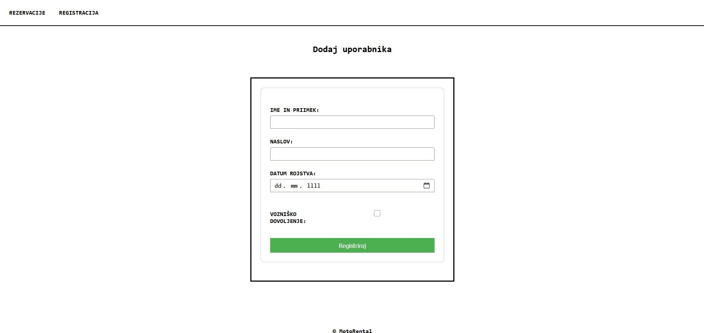

# MotoRental aplikacija

MotoRental spletna aplikacija omogoča najem motornih vozil.

## Funkcionalnosti

Spletna aplikacija omogoča:
- registracijo in vnos novega uporabnika v bazo,
- pregled rezervacij motornih vozil.

## Namestitev in zagon
- kloniraj repozitorij  
- zaženi backend
- zaženi frontend
- spletna aplikacija dostopna na: http://localhost:8080
- H2 podatkovna baza dostopna na: http://localhost:8080/h2-console

## Screenshots

--

--
